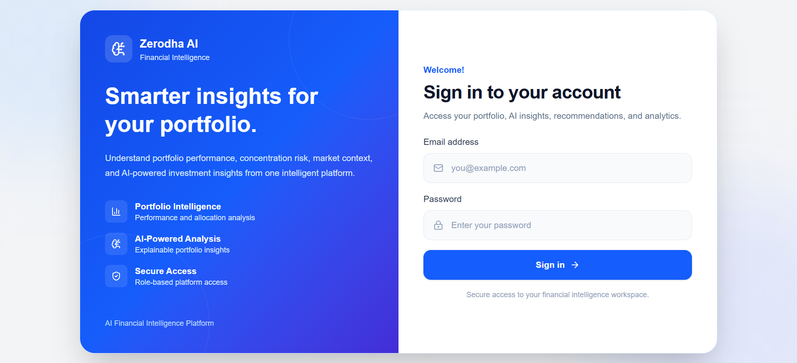
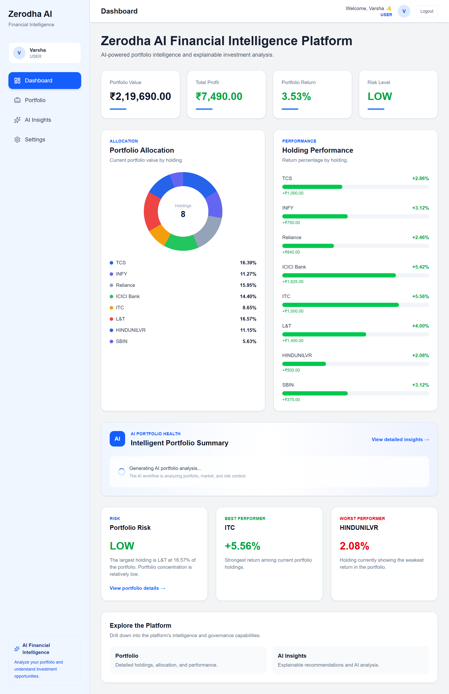
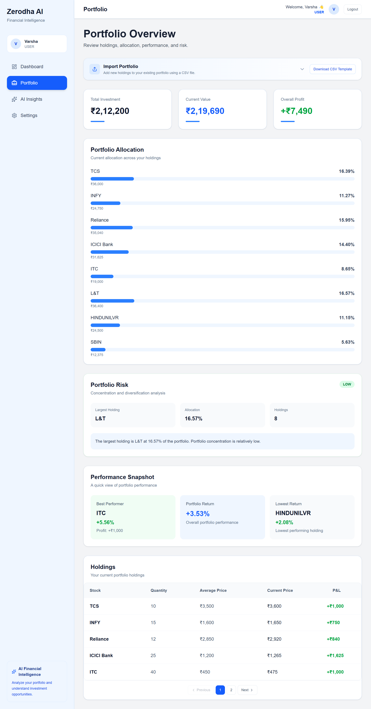
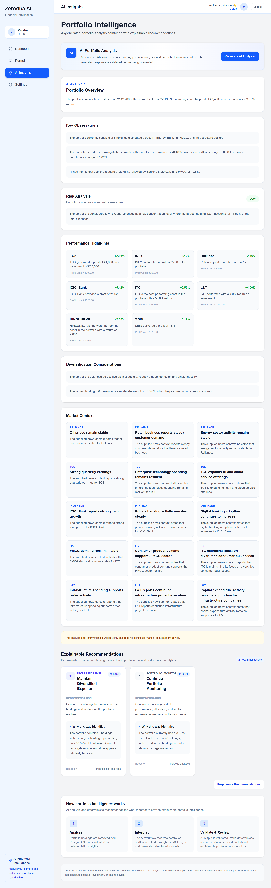
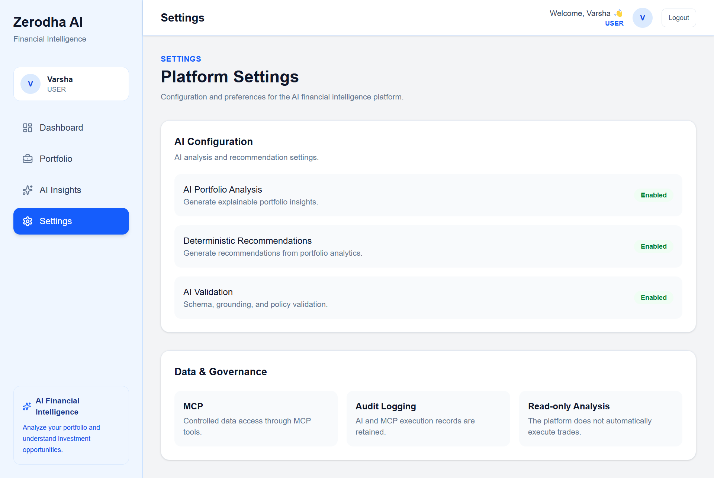
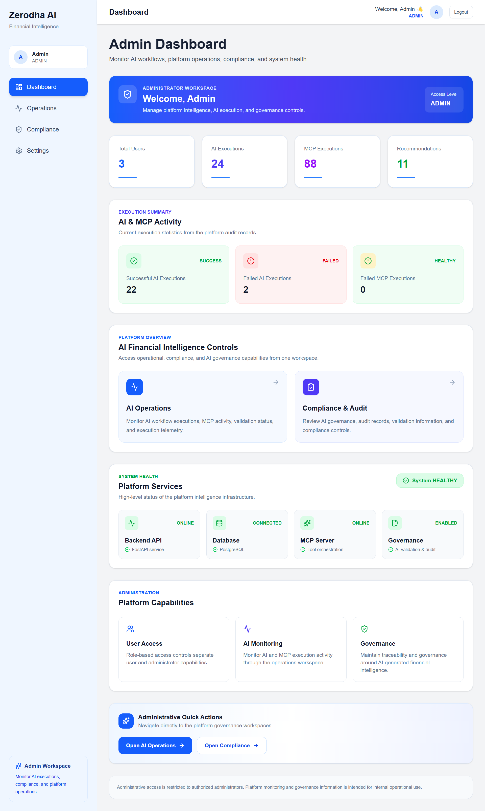
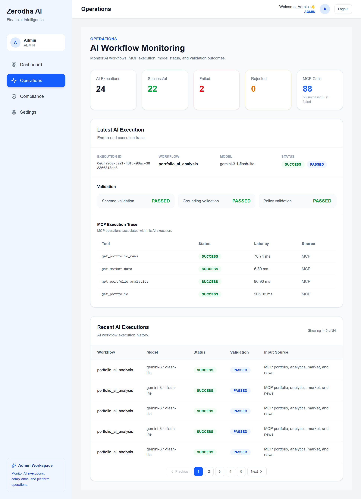
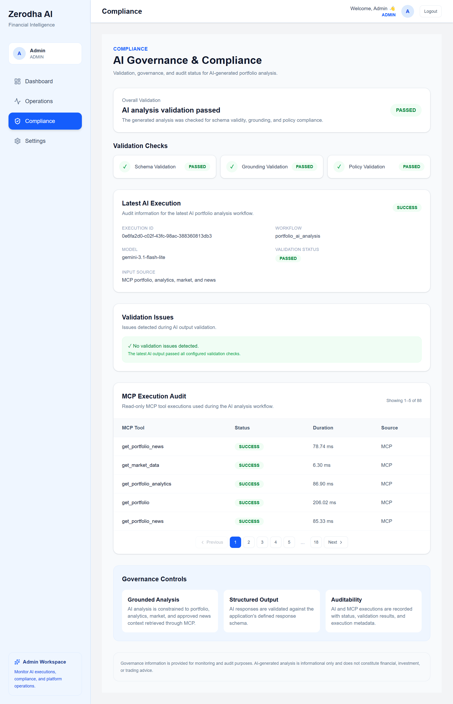
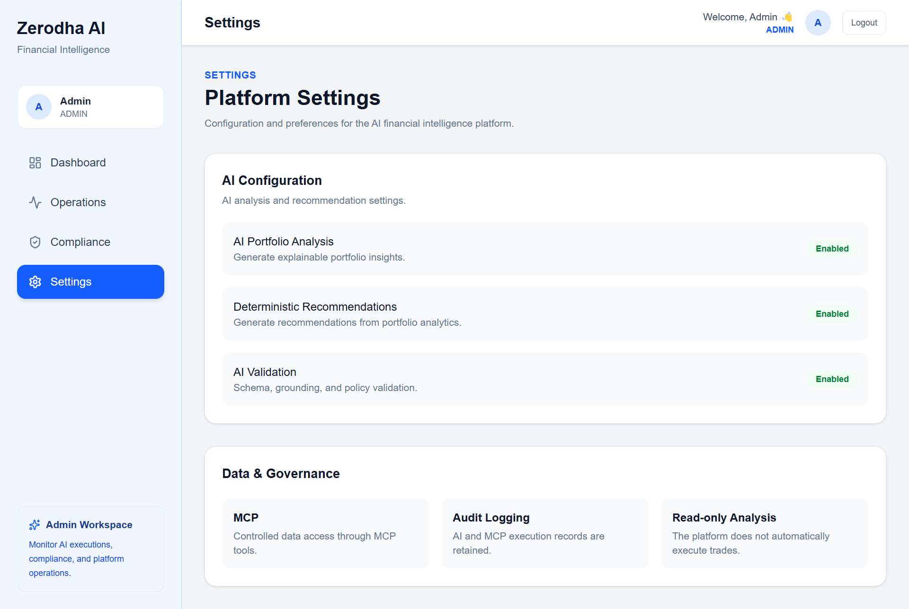

# Zerodha AI Financial Intelligence Platform

> **AI-powered portfolio intelligence with deterministic analytics, MCP-based data access, explainable insights, and governed recommendations.**

The **Zerodha AI Financial Intelligence Platform** is a full-stack financial intelligence application that helps investors understand portfolio performance, allocation, concentration, risk, and relevant market context through a controlled AI workflow.

The platform combines **Next.js, FastAPI, PostgreSQL, deterministic financial analytics, Model Context Protocol (MCP), Google Gemini, structured output validation, recommendation rules, JWT authentication, role-based access control, and audit telemetry** into a single application.

> **Project scope:** This is a portfolio-intelligence prototype using sample portfolio, market, and news data. It is not a trading or order-execution system, and its recommendations are informational rather than financial advice.

---

## Why This Project

Traditional portfolio dashboards are effective at displaying numbers, but investors often need help answering the next question: **what do these numbers mean?**

This project adds an intelligence layer that connects deterministic portfolio analytics with contextual AI explanations. The design deliberately separates **financial facts** from **AI interpretation** so that the language model is not responsible for calculating the underlying portfolio metrics.

The system is designed around four principles:

- **Grounded:** AI receives structured application data rather than inventing portfolio facts.
- **Explainable:** insights and recommendation signals include supporting context and rationale.
- **Controlled:** MCP exposes explicit tools instead of giving the AI unrestricted application access.
- **Governed:** validation, authentication, role separation, disclaimers, and execution telemetry are built into the workflow.

---

## Product Capabilities

### Investor Experience

- Secure user login with JWT authentication.
- User-specific portfolio data and holdings.
- Portfolio overview with investment, current value, profit/loss, and return metrics.
- Portfolio allocation and sector exposure analysis.
- Risk and concentration analysis.
- Performance and stock-contribution analysis.
- Volatility, drawdown, and benchmark comparison metrics.
- AI-generated portfolio insights.
- Explainable recommendation cards with confidence and supporting metrics.
- Portfolio CSV upload.
- User settings and account experience.

### AI and Analytics

- Controlled **Portfolio Agent** workflow.
- Deterministic analytics before AI interpretation.
- MCP tools for portfolio, analytics, market, and news context.
- Google Gemini integration.
- Structured AI response parsing.
- Schema validation.
- Grounding and financial-fact consistency checks.
- Risk consistency checks.
- Prohibited-language/policy checks.
- Confidence levels and informational disclaimer.
- AI and MCP execution telemetry.

### Operations and Governance

- Separate USER and ADMIN experiences.
- ADMIN-only operations and compliance surfaces.
- User, AI execution, MCP execution, and recommendation statistics.
- Backend and database health checks.
- MCP initialization and tool-discovery health checks.
- Governance/validation status visibility.
- Reviewable AI/MCP execution records.
- Protected audit endpoints.

---

## Architecture

```text
┌──────────────────────────────┐
│       Next.js Frontend       │
│  React + TypeScript +        │
│  Tailwind CSS                │
└──────────────┬───────────────┘
               │ REST / JWT
               ▼
┌──────────────────────────────┐
│        FastAPI Backend       │
│ Auth • APIs • Orchestration  │
└───────┬──────────────┬───────┘
        │              │
        ▼              ▼
┌──────────────┐  ┌──────────────────┐
│ PostgreSQL   │  │ Analytics Engine │
│ Users        │  │ Allocation       │
│ Holdings     │  │ Risk             │
│ AI Records   │  │ Performance      │
│ MCP Records  │  │ Contribution     │
│ Recommends   │  │ Sector/Benchmark │
└──────────────┘  └────────┬─────────┘
                           │
                           ▼
                  ┌──────────────────┐
                  │    MCP Server    │
                  │ Governed Tools   │
                  └────────┬─────────┘
                           │
                           ▼
                  ┌──────────────────┐
                  │  Portfolio Agent │
                  │ Context Assembly │
                  └────────┬─────────┘
                           │
                           ▼
                  ┌──────────────────┐
                  │  Google Gemini   │
                  │ AI Interpretation │
                  └────────┬─────────┘
                           │
                           ▼
                  ┌──────────────────┐
                  │    Validation    │
                  │ Schema • Ground  │
                  │ Risk • Policy    │
                  └────────┬─────────┘
                           │
                           ▼
                  ┌──────────────────┐
                  │ Insights /       │
                  │ Recommendations  │
                  │ + Audit Records  │
                  └──────────────────┘
```

### Architecture Layers

| Layer | Responsibility |
|---|---|
| Frontend | Investor dashboard, AI insights, portfolio views, settings, and admin surfaces |
| Backend | REST APIs, authentication, authorization, orchestration, business logic |
| Database | Users, holdings, recommendations, AI execution records, MCP execution records |
| Analytics | Deterministic portfolio, allocation, performance, risk, sector, contribution, volatility, drawdown, and benchmark calculations |
| MCP | Controlled access to explicit portfolio, analytics, market, and news tools |
| Portfolio Agent | Coordinates context retrieval and AI analysis rather than executing trades |
| Gemini | Interprets grounded structured context and produces an explanation |
| Validation | Checks schema, supported facts, risk consistency, and prohibited language |
| Audit | Persists AI/MCP execution telemetry for operational visibility |

---

## End-to-End AI Workflow

```text
1. User requests portfolio intelligence
                 ↓
2. FastAPI authenticates the user
                 ↓
3. Portfolio and deterministic analytics are assembled
                 ↓
4. Portfolio Agent requests approved MCP tools
                 ↓
5. MCP returns structured portfolio / analytics / market / news context
                 ↓
6. Context is supplied to Google Gemini
                 ↓
7. Gemini returns structured insight content
                 ↓
8. Validation checks schema, grounding, risk consistency and policy rules
                 ↓
9. Validated insight/recommendation is presented to the user
                 ↓
10. AI and MCP execution telemetry is persisted for operations/compliance
```

### Controlled Agentic Design

The application uses a **controlled agentic workflow**, with a single Portfolio Agent coordinating the retrieval and interpretation process. It is intentionally **not** a multi-agent trading system.

The agent does not place orders or independently act on the user's brokerage account. Its role is to retrieve approved context, invoke the AI interpretation step, and pass the result through application-level validation before presentation.

---

## Deterministic Analytics

Financial calculations are performed by the application rather than delegated to the language model.

The analytics layer includes:

- Total investment.
- Current portfolio value.
- Profit/loss.
- Return percentage.
- Portfolio allocation.
- Concentration indicators.
- Sector exposure.
- Stock-level contribution to portfolio performance.
- Performance analysis.
- Volatility.
- Drawdown.
- Benchmark comparison.
- Data freshness/context metadata.

This separation allows the AI layer to focus on **explaining verified metrics** instead of generating the metrics itself.

---

## MCP Integration

The Model Context Protocol layer provides explicit tools that the AI workflow can request.

Current tools include:

```text
get_portfolio
get_portfolio_summary
get_portfolio_allocation
get_portfolio_risk
get_portfolio_performance
get_portfolio_analytics
get_market_data
get_market_news
get_portfolio_news
```

MCP is used as a governed tool boundary between the Portfolio Agent and application data/services. Tool execution is recorded for operational visibility.

Detailed MCP documentation is maintained in [`docs/mcp.md`](docs/mcp.md).

---

## AI Safety and Governance

Financial AI requires stronger controls than a general-purpose conversational interface. This project therefore follows a **"calculate first, interpret second, validate before display"** approach.

### Grounding

The AI workflow receives structured context produced by the application and MCP tools. The system prompt instructs Gemini to rely only on the supplied context and avoid unsupported claims.

### Validation

AI output is checked for:

- Required structured fields.
- Supported portfolio facts.
- Profit/return consistency.
- Risk consistency.
- Prohibited or overly directive trading language.
- Required disclaimer behavior.

### Recommendation Safety

Recommendations are expressed as review, monitoring, or portfolio-management signals rather than guaranteed outcomes or autonomous trade instructions.

### Human Review Readiness

The architecture preserves execution and validation records so that policy-sensitive outputs can be reviewed through the administrative operations/compliance surfaces.

---

## Authentication and Security

The application implements:

- Password hashing using bcrypt.
- JWT access tokens with expiration.
- Bearer-token authentication for protected API requests.
- Role-based access control with USER and ADMIN roles.
- User-scoped portfolio and recommendation queries.
- ADMIN-only operations and audit endpoints.
- Backend-only storage of Gemini and database secrets.
- Environment-based CORS configuration.

The security model is designed to prevent one authenticated user from retrieving another user's portfolio data through normal application APIs.

> This project demonstrates application-level authentication and authorization. It should not be described as a production brokerage security system.

---

## Data and Demo Sources

The current demonstration uses project/sample data rather than a live brokerage connection.

| File | Purpose |
|---|---|
| `data/portfolio.json` | Portfolio/holding data used by the application |
| `data/sample_portfolio.csv` | Sample portfolio upload data |
| `data/sample_market_data.csv` | Sample market and benchmark context |
| `data/sample_news.csv` | Sample market/news context |

No live broker credentials or trading execution are required for the demonstration.

### Future Data Integrations

The architecture can be extended with live market feeds and brokerage APIs while retaining the same separation between retrieval, deterministic analytics, AI interpretation, and validation.

---

## Technology Stack

| Area | Technology |
|---|---|
| Frontend | Next.js 16, React 19, TypeScript, Tailwind CSS |
| Backend | Python, FastAPI, Pydantic |
| Database | PostgreSQL, SQLAlchemy |
| AI | Google Gemini API |
| AI Integration | Model Context Protocol (MCP), Portfolio Agent workflow |
| Authentication | bcrypt, JWT, role-based access control |
| API Documentation | FastAPI / OpenAPI / Swagger UI |
| Deployment | Render |

---

## Repository Structure

```text
zerodha-ai-financial-intelligence-platform/
│
├── ai_workflows/          # AI workflow / Portfolio Agent code
├── backend/               # FastAPI backend
│   └── app/
│       ├── api/           # REST API routers
│       ├── auth/          # JWT and password security
│       ├── database/      # Database configuration and models
│       ├── schemas/       # Pydantic schemas
│       ├── services/      # Business logic, analytics, AI, validation
│       └── main.py        # FastAPI entry point
│
├── data/                  # Sample portfolio, market and news data
├── deployment/            # Deployment-related resources
├── docs/                  # Architecture, API, MCP and demo documentation
│   └── screenshots/       # Application screenshots
├── frontend/              # Next.js application
│   ├── app/               # Routes and pages
│   ├── components/        # Reusable UI components
│   ├── context/           # Authentication/application context
│   └── lib/               # API client and frontend utilities
├── mcp_server/            # MCP server and tool definitions
├── requirements.txt       # Python dependencies
├── .env.example           # Environment variable template
└── README.md              # Project overview and setup guide
```

---

## Local Setup

### Prerequisites

- Python 3.12+
- Node.js and npm
- PostgreSQL
- Git

### 1. Clone the repository

```bash
git clone https://github.com/Varsha-Salimon/zerodha-ai-financial-intelligence-platform.git
cd zerodha-ai-financial-intelligence-platform
```

### 2. Backend environment

```bash
cd backend
python -m venv venv
```

Windows:

```bash
venv\Scripts\activate
```

macOS/Linux:

```bash
source venv/bin/activate
```

Install Python dependencies:

```bash
pip install -r ../requirements.txt
```

### 3. Configure environment variables

Create a `.env` file using the root `.env.example` as the reference.

Configure the PostgreSQL database, Gemini API key, JWT secret, and frontend origin before starting the backend.

### 4. Start the backend

From the `backend` directory:

```bash
uvicorn app.main:app --reload
```

Backend:

```text
http://127.0.0.1:8000
```

Swagger UI:

```text
http://127.0.0.1:8000/docs
```

OpenAPI schema:

```text
http://127.0.0.1:8000/openapi.json
```

### 5. Start the frontend

Open a second terminal:

```bash
cd frontend
npm install
npm run dev
```

Frontend:

```text
http://localhost:3000
```

Set `NEXT_PUBLIC_API_URL` to the backend URL used by the frontend.

### Database

The backend uses PostgreSQL through SQLAlchemy. Database initialization and seed behavior are implemented in the backend application; deployment-specific database configuration is supplied through environment variables.

---

## Environment Variables

Do not commit real credentials to the repository.

| Variable | Purpose |
|---|---|
| `DATABASE_URL` | PostgreSQL connection string |
| `GEMINI_API_KEY` | Google Gemini API key |
| `GEMINI_MODEL` | Gemini model used by the AI workflow |
| `JWT_SECRET_KEY` | Secret used to sign JWT access tokens |
| `FRONTEND_URL` | Frontend origin allowed by backend CORS |
| `NEXT_PUBLIC_API_URL` | Backend API URL consumed by the frontend |

Example configuration:

```env
DATABASE_URL=postgresql://<user>:<password>@<host>:<port>/<database>
GEMINI_API_KEY=<your-gemini-api-key>
GEMINI_MODEL=gemini-3.1-flash-lite
JWT_SECRET_KEY=<strong-random-secret>
FRONTEND_URL=http://localhost:3000
NEXT_PUBLIC_API_URL=http://127.0.0.1:8000
```

---

## API Overview

The FastAPI backend exposes the following application areas.

### Authentication

```text
POST /api/auth/login
GET  /api/auth/me
```

### Portfolio

```text
GET  /api/portfolio/
GET  /api/portfolio/summary
GET  /api/portfolio/allocation
GET  /api/portfolio/risk
GET  /api/portfolio/performance
POST /api/portfolio/upload
```

### Insights

```text
GET /api/insights/
GET /api/insights/ai
```

### Recommendations

```text
GET  /api/recommendations
POST /api/recommendations/generate
```

### Analytics

```text
GET /api/analytics/summary
GET /api/analytics/allocation
GET /api/analytics/risk
GET /api/analytics/performance
GET /api/analytics/contribution
```

### Audit

```text
GET /api/audit/executions
GET /api/audit/mcp-executions
```

These endpoints are protected and intended for administrative/operations use.

### Admin

```text
GET /api/admin/summary
GET /api/admin/health
```

All API routes should be exercised through the deployed application's authentication flow or the local Swagger UI rather than by exposing credentials in documentation.

For complete request/response details, see [`docs/api_documentation.md`](docs/api_documentation.md).

---

## Application Screenshots

The screenshots below show the implemented user and administrative product surfaces.

### Authentication



### User Dashboard



### Portfolio



### AI Insights



### User Settings



### Admin Dashboard



### Operations



### Compliance



### Admin Settings




---

## Engineering Highlights

This project demonstrates practical full-stack engineering across several areas:

- Designed and implemented a role-aware financial intelligence application rather than a standalone chatbot.
- Built REST APIs with FastAPI and connected them to PostgreSQL through SQLAlchemy.
- Implemented JWT authentication, bcrypt password hashing, role-based access control, and user-scoped data access.
- Built deterministic financial analytics for portfolio performance, allocation, concentration, risk, contribution, sector exposure, volatility, drawdown, and benchmark comparison.
- Integrated MCP as a controlled tool layer for portfolio, analytics, market, and news retrieval.
- Implemented a Portfolio Agent workflow that assembles structured context for Gemini.
- Added AI output validation for schema, grounding, risk consistency, and prohibited language.
- Implemented explainable recommendation cards with confidence, supporting metrics, source context, and disclaimers.
- Built separate investor and administrative experiences for product usage and operational visibility.
- Deployed the frontend and backend as separate services on Render.

---

## Project Contribution

The project work covered the full application lifecycle, including:

- Product and system design.
- Next.js frontend development.
- FastAPI backend and REST API development.
- PostgreSQL/SQLAlchemy data modeling.
- Deterministic portfolio analytics.
- MCP server and tool integration.
- Gemini-based AI workflow integration.
- AI validation and recommendation logic.
- Authentication and authorization.
- Investor and admin dashboard implementation.
- Deployment configuration.
- Technical documentation and demo preparation.

The implementation intentionally keeps the architecture understandable and reviewable so that the AI layer can be demonstrated as a controlled financial-intelligence workflow rather than an opaque chatbot.

---

## Deployment

The current demonstration is deployed as separate frontend and backend services.

- **Live application:** https://zerodha-ai-frontend.onrender.com/
  
- **Backend API:** https://zerodha-ai-backend-1ftk.onrender.com
- **Swagger UI:** https://zerodha-ai-backend-1ftk.onrender.com/docs

- Test USER account
  Email: varsha@demo.com
  Password: varsha123
  
- Test ADMIN account
  Email: admin@demo.com
  Password: admin123

Deployment configuration is environment-driven, with secrets kept outside the repository.

### Deployment Note

This application is deployed on Render's free tier. After a period of
inactivity, the backend may take a short time to wake up.

If the application does not respond immediately, please open the
**[Swagger UI](https://zerodha-ai-backend-1ftk.onrender.com/docs)**,
wait a few seconds for the backend to initialize, and then attempt to
log in to the frontend.

---

## Documentation

Additional project documentation is available under [`docs/`](docs/):

- [`docs/architecture.md`](docs/architecture.md) — system architecture and component responsibilities.
- [`docs/api_documentation.md`](docs/api_documentation.md) — REST API reference and endpoint behavior.
- [`docs/mcp.md`](docs/mcp.md) — MCP tools, schemas, configuration, and startup information.
- [`docs/demo_script.md`](docs/demo_script.md) — end-to-end demonstration flow.

The repository also contains sample portfolio, market, and news data under [`data/`](data/).

---

## Current Scope and Limitations

The current version intentionally focuses on portfolio intelligence rather than brokerage execution.

- Market and news inputs use sample/project data.
- No live order placement is performed.
- No autonomous trading decisions are executed.
- Advanced real-time risk engines are outside the current scope.
- A production deployment would require additional security hardening, monitoring, compliance review, load testing, and live-data reliability controls.

These boundaries keep the prototype focused on the core problem: **turning structured portfolio data into explainable, validated financial intelligence.**

---

## Future Enhancements

Potential extensions include:

- Live market-data integrations.
- Broker/brokerage API integrations.
- Advanced risk models and stress testing.
- Personalized risk profiles.
- Real-time portfolio alerts.
- Expanded market and news retrieval.
- Stronger model evaluation and monitoring.
- Human-in-the-loop review workflows for policy-sensitive recommendations.
- Production-scale observability and performance monitoring.

---

## Disclaimer

This project is an educational/prototype financial-intelligence application. Its analytics and AI-generated outputs are based on the supplied project data and are intended for informational purposes only. They do not constitute investment, financial, tax, or legal advice, and the application does not execute trades.
