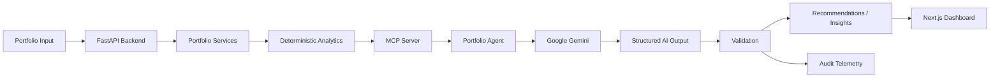
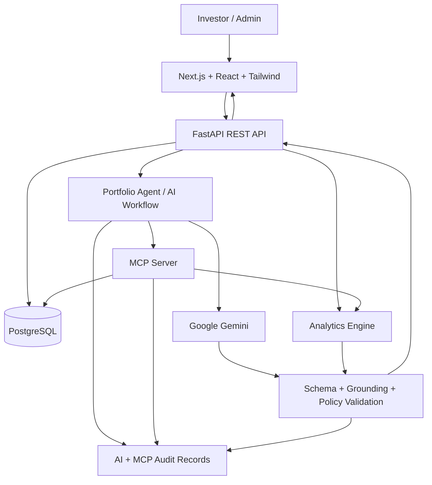

# Zerodha AI Financial Intelligence Platform

> **AI-powered portfolio analysis, explainable insights, risk intelligence, and governed recommendations**

The Zerodha AI Financial Intelligence Platform is a full-stack financial intelligence prototype designed to help investors understand portfolio performance, allocation, concentration, risk, and market context through a controlled AI workflow.

The platform combines **deterministic financial analytics** with **MCP-based tool access**, **Google Gemini**, structured AI outputs, validation, recommendation rules, authentication, and audit telemetry.

---

## Project Overview

Traditional portfolio dashboards are good at showing numbers, but investors still need help understanding what those numbers mean. This project adds an intelligence layer on top of portfolio data so that users can move from raw metrics to contextual, explainable insights.

The system follows this high-level flow:

```text
Portfolio Input
      ↓
FastAPI Backend
      ↓
Deterministic Analytics
      ↓
MCP Tool Layer
      ↓
Portfolio Agent / AI Workflow
      ↓
Google Gemini
      ↓
Structured AI Output
      ↓
Schema + Grounding + Policy Validation
      ↓
Recommendations + Audit Telemetry
      ↓
Next.js Dashboard
```

The project is intentionally a **controlled/limited agentic AI workflow**, not a fully autonomous trading system. The AI interprets supplied, structured financial context and does not execute trades.

---

## Business Problem

Investors often have access to portfolio values, profit/loss, holdings, and market information, but several questions still require manual interpretation:

- Which holdings are driving portfolio performance?
- Is the portfolio overly concentrated?
- How diversified is the current allocation?
- Which risk indicators require attention?
- What market or news context may be relevant?
- Can AI explain portfolio information without inventing financial facts?

A financial AI system also needs stronger controls than a general-purpose chatbot because unsupported numbers, hallucinated claims, or overly directive trading language can reduce trust and create compliance concerns.

---

## Product Goal

The goal is to provide a **trustworthy portfolio intelligence layer** that:

1. Calculates important financial metrics deterministically.
2. Retrieves approved portfolio, market, analytics, and news context through controlled MCP tools.
3. Uses Gemini to interpret verified context and generate structured explanations.
4. Validates AI output before it reaches the user.
5. Provides explainable recommendation signals with supporting metrics and disclaimers.
6. Gives operations and compliance users visibility into AI/MCP executions and validation status.

---

## Key Features

### Investor Experience

- Portfolio overview and KPIs
- Holdings table with investment, current value, and profit/loss
- Portfolio allocation analysis
- Performance analysis
- Risk and concentration analysis
- Sector exposure
- Stock contribution analysis
- AI-generated portfolio insights
- Explainable recommendation cards
- Portfolio CSV upload
- User-specific portfolio data

### AI and Governance

- Controlled Portfolio Agent workflow
- MCP-based structured tool access
- Google Gemini integration
- Structured AI response schema
- Deterministic analytics before AI interpretation
- Grounding validation
- Risk consistency validation
- Policy/prohibited-language validation
- Confidence levels
- Financial-information disclaimer
- AI execution audit records
- MCP execution telemetry

### Internal Operations

- ADMIN-only dashboard
- User counts
- AI execution statistics
- MCP execution statistics
- Recommendation counts
- Database health
- Backend health
- MCP health and tool discovery
- Governance/validation status
- Operations monitoring
- Compliance review surface

### Security

- Password hashing with bcrypt
- JWT authentication
- Token expiration
- Role-based access control
- USER and ADMIN separation
- User-scoped portfolio queries
- Protected administrative endpoints
- Backend-only secrets
- CORS configuration through environment variables

---

## Product Workflow



---

## System Architecture



### Architecture Layers

| Layer | Responsibility |
|---|---|
| Frontend | Investor and internal dashboard experience |
| Backend | REST APIs, authentication, business logic, orchestration |
| Database | Users, holdings, recommendations, AI/MCP execution records |
| Analytics | Deterministic portfolio, performance, allocation, risk calculations |
| MCP | Governed access to portfolio, analytics, market and news tools |
| AI Workflow | Coordinates context retrieval and Gemini analysis |
| Gemini | Interprets verified structured context |
| Validation | Schema, grounding, risk and policy checks |
| Audit | Records AI/MCP execution and validation telemetry |

---

## AI Workflow

The project uses a **controlled agentic AI architecture**.

### Step 1 — Portfolio Context

The authenticated user requests portfolio intelligence from the frontend.

### Step 2 — Backend Orchestration

FastAPI identifies the authenticated user and retrieves the user's portfolio context.

### Step 3 — Deterministic Analytics

The analytics layer calculates financial metrics such as:

- investment
- current value
- profit/loss
- return percentage
- allocation
- concentration
- sector exposure
- volatility
- drawdown
- benchmark comparison
- stock contribution

### Step 4 — MCP Tool Access

The Portfolio Agent communicates with the MCP server and uses approved tools to obtain structured context such as portfolio information, portfolio analytics, market data, and portfolio-relevant news.

### Step 5 — Gemini Analysis

The structured context is passed to Google Gemini. The prompt instructs the model to use only the supplied information and avoid unsupported financial claims or guaranteed returns.

### Step 6 — Structured Output

The AI response is parsed into the application's expected structured schema.

### Step 7 — Validation

The output is checked for:

- expected schema
- supported portfolio facts
- return/profit consistency
- risk consistency
- prohibited or overly directive trading language
- disclaimer requirements

### Step 8 — Presentation and Audit

Only the validated result is presented through the dashboard, while workflow and validation telemetry are persisted for operations/compliance visibility.

---

## Responsible AI Approach

The platform is designed around the principle:

> **AI generates interpretation; deterministic systems verify financial facts.**

The application does not treat Gemini as the source of truth for portfolio calculations. Core metrics are calculated programmatically first and supplied as grounded context.

Recommendations are phrased as review/monitoring signals rather than guaranteed outcomes or autonomous trade instructions. The application also includes an informational disclaimer.

---

## Tools and Technologies

### Frontend

- Next.js 16
- React 19
- TypeScript
- Tailwind CSS
- Lucide React

### Backend

- Python
- FastAPI
- REST APIs
- Pydantic

### Database

- PostgreSQL
- SQLAlchemy

### AI

- Google Gemini API
- Controlled Portfolio Agent workflow
- Structured output validation

### AI Integration

- Model Context Protocol (MCP)
- MCP server with portfolio, analytics, market and news tools

### Security

- bcrypt
- JWT / Bearer authentication
- Role-based access control

### Deployment

- Frontend: Render
- Backend: Render
- Database: PostgreSQL

---

## Data Sources Used

The current demonstration uses project/sample data rather than a live brokerage connection.

Available sample data includes:

- `data/portfolio.json` — portfolio/holding data
- `data/sample_portfolio.csv` — sample portfolio upload data
- `data/sample_market_data.csv` — sample market/benchmark data
- `data/sample_news.csv` — sample market/news context

The application is designed so that deterministic analytics operate on structured portfolio data before AI interpretation.

### Future Data Sources

The specification identifies live market data and brokerage APIs as future extensions. A production version could integrate live market feeds and broker APIs while keeping credentials server-side.

---

## Repository Structure

```text
zerodha-ai-financial-intelligence-platform/
│
├── ai_workflows/          # AI/Portfolio Agent workflow code
├── backend/               # FastAPI backend
│   └── app/
│       ├── api/           # REST API routers
│       ├── auth/          # JWT and password security
│       ├── database/      # SQLAlchemy models/database
│       ├── schemas/       # Pydantic schemas
│       ├── services/      # Business logic and analytics integration
│       └── main.py        # FastAPI application entry point
│
├── data/                  # Sample portfolio, market and news data
├── deployment/            # Deployment-related files/documentation
├── docs/                  # Project documentation
├── frontend/              # Next.js application
│   ├── app/
│   ├── components/
│   ├── context/
│   └── lib/
│
├── mcp_server/            # MCP server and tools
├── tests/                 # Test suite / testing evidence
├── .env.example           # Environment variable template
├── requirements.txt       # Backend Python dependencies
└── README.md              # Project documentation
```

---

## How to Run Locally

### Prerequisites

Install:

- Python 3.12+
- Node.js
- npm or Yarn
- PostgreSQL
- Git

### 1. Clone the Repository

```bash
git clone https://github.com/Varsha-Salimon/zerodha-ai-financial-intelligence-platform.git
cd zerodha-ai-financial-intelligence-platform
```

### 2. Backend Setup

```bash
cd backend
python -m venv venv
```

Windows:

```bash
venv\Scripts\activate
```

macOS/Linux:

```bash
source venv/bin/activate
```

Install dependencies:

```bash
pip install -r ../requirements.txt
```

### 3. Configure Backend Environment

Create a `.env` file using the root `.env.example` as a reference.

Configure PostgreSQL and the required AI/JWT settings before starting the backend.

### 4. Initialize / Seed the Database

Run the project's database migration/seed workflow as documented in `backend/`.

The demonstration environment contains USER and ADMIN roles and sample portfolio data.

### 5. Start the Backend

From the project root/backend environment:

```bash
uvicorn app.main:app --reload
```

Backend default local address:

```text
http://127.0.0.1:8000
```

FastAPI automatically provides interactive OpenAPI/Swagger documentation at:

```text
http://127.0.0.1:8000/docs
```

### 6. Start the Frontend

Open another terminal:

```bash
cd frontend
npm install
npm run dev
```

Frontend default address:

```text
http://localhost:3000
```

Set `NEXT_PUBLIC_API_URL` to the local backend URL when running locally.

---

## Environment Variables

Never commit real secrets to GitHub.

| Variable | Purpose |
|---|---|
| `DATABASE_URL` | PostgreSQL connection string |
| `GEMINI_API_KEY` | Google Gemini API key |
| `GEMINI_MODEL` | Gemini model used by the AI workflow |
| `JWT_SECRET_KEY` | Secret used to sign JWT access tokens |
| `FRONTEND_URL` | Frontend origin used by backend CORS configuration |
| `NEXT_PUBLIC_API_URL` | Backend API URL used by the Next.js frontend |

Example:

```env
DATABASE_URL=postgresql://<user>:<password>@<host>:<port>/<database>
GEMINI_API_KEY=<your-gemini-api-key>
GEMINI_MODEL=gemini-3.1-flash-lite
JWT_SECRET_KEY=<strong-random-secret>
FRONTEND_URL=http://localhost:3000
NEXT_PUBLIC_API_URL=http://127.0.0.1:8000
```

For deployment, use the hosting provider's environment-variable configuration rather than committing secrets.

---

## Authentication and Authorization

The application uses JWT-based authentication with role-based access control.

```text
Login
  ↓
Backend validates email/password
  ↓
bcrypt password verification
  ↓
JWT created with user identity, role and expiry
  ↓
Frontend stores access token
  ↓
Protected requests send Bearer token
  ↓
Backend validates JWT
  ↓
User data is scoped to authenticated user
```

Administrative routes require the ADMIN role.

---

## API Details

The backend exposes REST APIs through FastAPI.

### Authentication

```text
POST /api/auth/login
GET  /api/auth/me
```

### Portfolio

```text
GET  /api/portfolio/
GET  /api/portfolio/summary
GET  /api/portfolio/allocation
GET  /api/portfolio/risk
GET  /api/portfolio/performance
POST /api/portfolio/upload
```

### Insights / AI

```text
GET /api/insights/
GET /api/insights/ai
```

### Recommendations

```text
GET  /api/recommendations
POST /api/recommendations/generate
```

### Analytics

```text
GET /api/analytics/summary
GET /api/analytics/allocation
GET /api/analytics/risk
GET /api/analytics/performance
GET /api/analytics/contribution
```

### Audit / Operations

```text
GET /api/audit/executions
GET /api/audit/mcp-executions
```

### Admin

```text
GET /api/admin/summary
GET /api/admin/health
```

### Interactive API Documentation

When the backend is running, FastAPI/OpenAPI provides Swagger UI at `/docs` and the OpenAPI schema at `/openapi.json`.

---

## MCP Tools

The MCP server provides controlled tools for the AI workflow, including:

```text
get_portfolio
get_portfolio_summary
get_portfolio_allocation
get_portfolio_risk
get_portfolio_performance
get_portfolio_analytics
get_market_data
get_market_news
get_portfolio_news
```

The purpose of MCP is to provide the AI workflow with explicit, structured capabilities rather than uncontrolled access to application data.

---

## Sample Input and Output

### Sample Portfolio Input

```json
{
  "stock": "TCS",
  "quantity": 10,
  "avg_price": 3500,
  "current_price": 3650,
  "sector": "IT"
}
```

### Example Deterministic Output

```json
{
  "investment": 35000,
  "current_value": 36500,
  "profit": 1500,
  "return_percentage": 4.29
}
```

### Example AI Insight Structure

```json
{
  "summary": "Portfolio performance is positive based on the supplied analytics.",
  "key_drivers": [],
  "risk_alerts": [],
  "recommendation_category": "MONITOR",
  "rationale": "Review allocation and portfolio concentration as conditions change.",
  "confidence": "MEDIUM",
  "freshness": "sample-data",
  "disclaimer": true
}
```

> The examples above illustrate the structure and should not be interpreted as live market information or financial advice.

---

## Evaluation Approach

The project is evaluated against the major areas defined in the project specification:

| Evaluation Area | Implementation Evidence |
|---|---|
| Product understanding | Investor pain point, financial intelligence goal, regulated-product boundaries |
| Product experience | Dashboard, portfolio, insights, recommendations, risk, operations and compliance surfaces |
| Backend/API | FastAPI REST APIs, authentication, portfolio services, analytics, recommendations and audit records |
| AI workflow | Portfolio Agent, MCP tools, Gemini, structured output and validation |
| Analytics/data quality | Deterministic allocation, concentration, performance, risk, sector and contribution metrics |
| Recommendation safety | Explainable signals, confidence, disclaimer and validation controls |
| Observability | AI/MCP execution records, statuses, validation status, duration and admin health |
| Deployment | Public frontend/backend deployment with configured environment variables |
| Documentation | README, architecture, API, workflow, data and deployment documentation |
| Demo | End-to-end portfolio → analytics → MCP → Gemini → validation → dashboard flow |

### Recommended Demo Flow

```text
1. Login
2. Dashboard
3. Portfolio
4. Portfolio Analytics
5. AI Insights
6. Recommendations
7. Operations
8. Compliance
9. Explain AI + MCP + validation architecture
```

---

## Screenshots

Screenshots should be stored in the repository under `docs/screenshots/` and referenced here.

Recommended screenshots for the final submission:

1. Login page
2. User Dashboard
3. Portfolio page
4. Analytics / Risk page
5. AI Insights page
6. Recommendation cards
7. Admin Operations page
8. Compliance page

Example Markdown after adding the images:

```markdown


```

> **Submission action:** add the actual application screenshots to `docs/screenshots/` before final submission. Do not use placeholder images in the final repository.

---

## Live Demo

**Frontend:**

https://zerodha-ai-frontend.onrender.com/

**Backend API:**

https://zerodha-ai-backend-1ftk.onrender.com

**Backend Swagger UI:**

https://zerodha-ai-backend-1ftk.onrender.com/docs

The live deployment is intended for demonstration and evaluation. The application currently uses demonstration/sample financial data and is not connected to a live brokerage account.

---

## Demo Script

### 1. Introduction

“This project is the Zerodha AI Financial Intelligence Platform. The goal is to transform portfolio data into understandable, explainable financial intelligence while keeping financial calculations deterministic and AI output controlled.”

### 2. Dashboard

“First, I log in and see the portfolio dashboard. It provides the main portfolio KPIs and a quick overview of performance.”

### 3. Portfolio and Analytics

“Next, the Portfolio page shows individual holdings, investment, current value and profit/loss. The analytics layer then calculates allocation, performance and risk metrics programmatically.”

### 4. AI Workflow

“When I request AI analysis, the Portfolio Agent obtains structured context through MCP tools. That context includes portfolio information and deterministic analytics, along with relevant market/news context. Gemini interprets that verified context and returns structured output.”

### 5. Validation

“Before the result reaches the user, the system validates the response for schema compliance, grounding, risk consistency and policy restrictions. This reduces the chance of unsupported financial claims.”

### 6. Recommendations

“The recommendation cards show explainable portfolio signals with supporting metrics, confidence and an informational disclaimer.”

### 7. Operations and Compliance

“Finally, the Operations and Compliance surfaces provide visibility into AI and MCP executions, validation status and system health. This demonstrates that the AI workflow is not treated as a black box.”

---

## Known Limitations

This project is a financial intelligence prototype and has the following limitations:

- Market and news information is based on sample/demo data rather than live feeds.
- There is no live Zerodha/Kite brokerage integration in the current version.
- The system does not execute trades.
- Advanced portfolio risk models are outside the current scope.
- The AI workflow is controlled and limited rather than fully autonomous.
- Recommendation logic is intended for informational portfolio review and not personalized financial advice.
- The current deployment is designed for demonstration rather than production brokerage operations.
- Background job queues, large-scale caching, advanced real-time alerting and scalable multi-agent orchestration are future extensions.

---

## Future Scope

Potential extensions include:

- Live market data integration
- Zerodha/Kite Connect integration
- Real-time portfolio refresh
- Advanced risk models
- Personalized risk profiles
- Real-time alerts
- More AI agents for specialized workflows
- Vector-based financial knowledge retrieval
- Scheduled portfolio intelligence jobs
- Advanced adoption and model-quality analytics
- Production-grade queueing and horizontal scaling

---

## Documentation

Additional documentation is maintained under `docs/`.

Recommended documentation areas:

```text
docs/
├── README.md
├── architecture.md
├── api_documentation.md
├── demo_script.md
└── screenshots/
```

---

## Team Contribution

The project covers the following contribution areas:

- Product understanding and business framing
- Frontend dashboard development
- FastAPI backend and REST API development
- PostgreSQL and SQLAlchemy data layer
- Portfolio analytics implementation
- MCP server and tool integration
- Gemini AI workflow integration
- AI output validation and governance
- Authentication and role-based access control
- Operations and compliance dashboard implementation
- Testing and deployment
- Documentation and presentation

For a team submission, add the exact member names and ownership beside each area before final submission.

---

## Security Notes

- Never commit `.env` files or API keys.
- Use `.env.example` only as a configuration template.
- Use strong production JWT secrets.
- Keep Gemini/API credentials on the backend.
- Use HTTPS for deployed environments.
- Review GitHub secret scanning and dependency/security alerts before submission.

---

## Project Status

**Status: Demonstration-ready full-stack prototype**

The core product flow is implemented across the frontend, backend, analytics, MCP, Gemini AI, validation, recommendations, authentication, operations and compliance surfaces.

Before final submission, complete the repository-level submission checklist:

- [ ] Protect audit endpoints with appropriate authentication/authorization.
- [ ] Add final screenshots under `docs/screenshots/`.
- [ ] Add testing evidence / tests.
- [ ] Complete MCP tooling documentation.
- [ ] Complete API and architecture documentation.
- [ ] Add final team member contribution details.
- [ ] Verify the deployed URLs.
- [ ] Upload the demo video and add the share link.

---

## License

This project is an educational/prototype implementation created for project evaluation and demonstration purposes.
