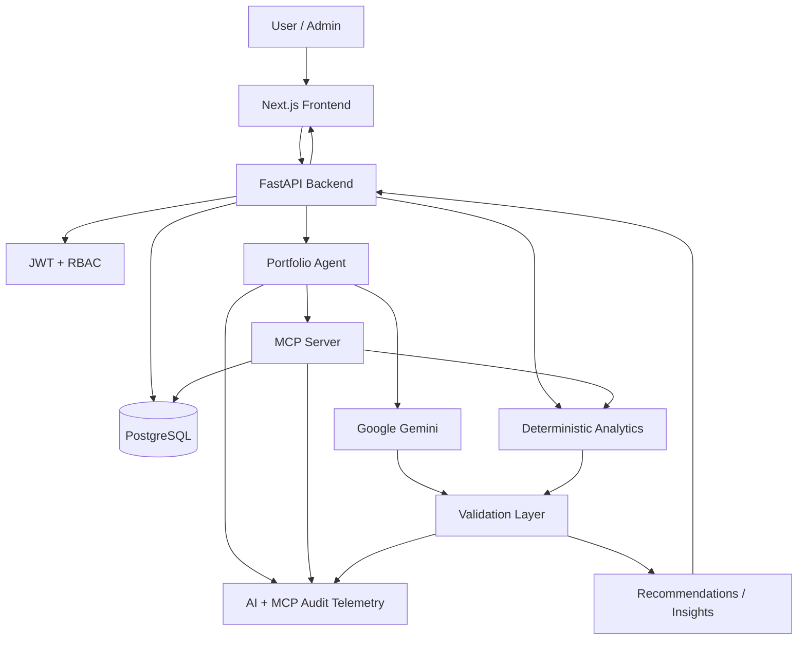

# System Architecture

## Overview

The Zerodha AI Financial Intelligence Platform is structured as a full-stack application with a clear separation between the presentation layer, API/orchestration layer, deterministic analytics, MCP tool access, AI interpretation, validation, and audit telemetry.

The central design principle is:

> **Calculate financial facts deterministically, use controlled tools to assemble context, let AI interpret the context, and validate the output before presentation.**

The application uses a single **Portfolio Agent** as the controlled agentic coordinator. It is not a multi-agent trading system and does not execute orders.

## High-Level Architecture



## Component Responsibilities

### Frontend

Technology: **Next.js, React, TypeScript, Tailwind CSS**.

Responsibilities:

- Authentication experience.
- Investor dashboard.
- Portfolio and holdings views.
- AI insights and recommendations.
- User settings.
- ADMIN dashboard.
- Operations and compliance views.
- API communication using authenticated requests.

The frontend does not contain the Gemini API key or database credentials.

### FastAPI Backend

The backend is the application's API and orchestration boundary.

Responsibilities:

- Authentication and authorization.
- User-scoped data access.
- Portfolio APIs.
- Analytics APIs.
- AI insight orchestration.
- Recommendation generation and persistence.
- Audit/operations APIs.
- Admin health and summary APIs.
- CORS configuration.

### PostgreSQL and SQLAlchemy

The database stores application state including:

- Users.
- Portfolio holdings.
- Recommendation records.
- AI execution records.
- MCP execution records.

Portfolio and recommendation records are associated with the authenticated user. Administrative audit endpoints are protected by the ADMIN role.

### Deterministic Analytics Engine

The analytics layer calculates portfolio facts independently of the language model.

Current calculations include:

- Portfolio summary.
- Allocation.
- Concentration/risk.
- Performance.
- Stock contribution.
- Sector exposure.
- Volatility markers.
- Drawdown markers.
- Benchmark comparison.
- Market-data freshness.

This reduces the risk of an LLM producing incorrect arithmetic or unsupported portfolio figures.

### MCP Server

The MCP server exposes explicit tools for the Portfolio Agent. The tool layer provides a controlled interface to portfolio, analytics, market, and news context.

Current tools:

- `get_portfolio`
- `get_portfolio_summary`
- `get_portfolio_allocation`
- `get_portfolio_risk`
- `get_portfolio_performance`
- `get_portfolio_analytics`
- `get_market_data`
- `get_market_news`
- `get_portfolio_news`

See [`mcp.md`](mcp.md) for tool-level details.

### Portfolio Agent

The Portfolio Agent coordinates the AI workflow. It retrieves the context required for portfolio intelligence and passes structured information to Gemini.

The agent is intentionally limited in scope:

- It does not place trades.
- It does not independently execute financial actions.
- It does not receive unrestricted database access.
- It uses explicit MCP capabilities.

### Google Gemini

Gemini is used for interpretation and explanation of supplied portfolio context.

The AI prompt is designed to:

- Use only supplied context.
- Avoid unsupported financial claims.
- Avoid guaranteed returns.
- Avoid autonomous trade instructions.
- Return the application's expected structured fields.

### Validation Layer

AI output is checked before presentation.

Validation covers:

- Structured response/schema expectations.
- Support for portfolio facts.
- Risk consistency.
- Performance/profit consistency.
- Prohibited or overly directive language.
- Disclaimer requirements.

### Audit Telemetry

AI and MCP execution records provide operational visibility into workflow activity, execution status, validation status, tool name, duration, and errors where available.

## Request Flow

### Standard Portfolio Request

```text
Browser
  ↓
Authenticated API request
  ↓
FastAPI route
  ↓
User identity validation
  ↓
Portfolio service / database
  ↓
Deterministic analytics
  ↓
Response to frontend
```

### AI Insight Request

```text
Browser
  ↓
GET /api/insights/ai
  ↓
FastAPI authenticates user
  ↓
Portfolio Agent
  ↓
MCP tool calls
  ↓
Structured portfolio + analytics + market/news context
  ↓
Google Gemini
  ↓
Structured AI response
  ↓
Validation
  ↓
Validated insight
  ↓
Audit telemetry
  ↓
Frontend
```

## Security Boundaries

1. Credentials are submitted to the backend authentication API.
2. Passwords are verified using bcrypt hashes.
3. Successful authentication produces a JWT with user identity, role, and expiry.
4. Protected requests carry the JWT as a Bearer token.
5. Backend dependencies validate the token and resolve the current user.
6. Portfolio/recommendation operations use the authenticated user's identity.
7. Administrative endpoints require ADMIN authorization.
8. AI and database secrets remain server-side.

## Deployment Architecture

The demonstration deployment separates the frontend and backend services:

```text
User Browser
     │
     ▼
Render - Next.js Frontend
     │
     │ HTTPS API requests
     ▼
Render - FastAPI Backend
     │
     ├── PostgreSQL
     ├── Gemini API
     └── MCP / Analytics workflow
```

Environment variables provide deployment-specific configuration.

## Design Trade-offs

### Why deterministic analytics before AI?

Financial metrics such as profit, allocation, and return are better computed with deterministic code. The LLM is therefore used primarily for interpretation and explanation.

### Why MCP?

MCP provides a clear tool boundary. The agent can request explicit capabilities instead of receiving uncontrolled access to the application's internal implementation.

### Why a single Portfolio Agent?

The current product problem does not require multiple autonomous agents. A single coordinator keeps the workflow easier to reason about, test, demonstrate, and govern.

### Why sample data?

The prototype focuses on the intelligence workflow and governance architecture without requiring live brokerage credentials or order execution. Live market/broker integrations remain future extensions.

## Known Architectural Limitations

- The demonstration uses sample market and news data.
- The current system is not an order-execution platform.
- Advanced real-time risk engines are outside the prototype scope.
- Production use would require additional security hardening, load testing, reliability engineering, compliance review, and expanded observability.
